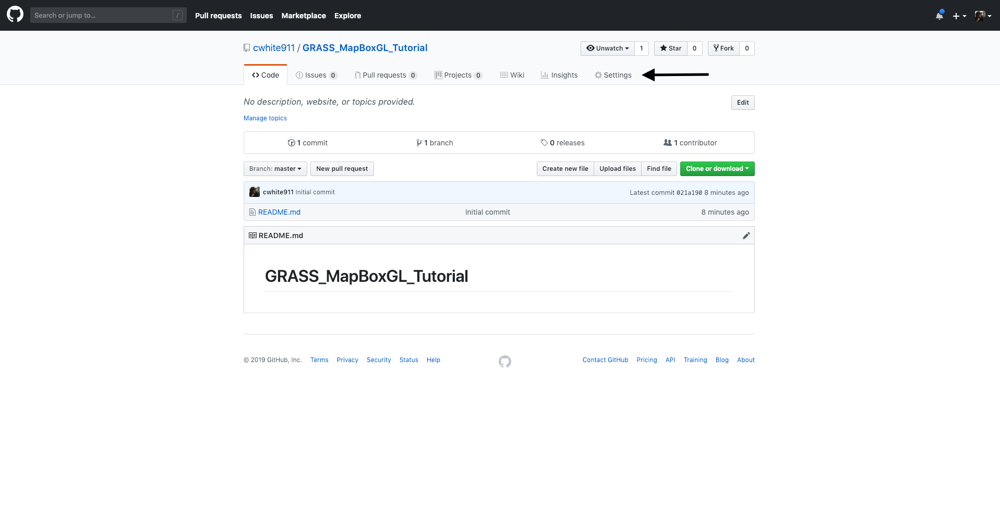

# GRASS MapBoxGL Tutorial

## How to Host Your Animated GRASS simulations with MapBoxGL JS and GitHub


## Requirements
* [GitHub Account](https://github.com/)
* [MapBox Account](https://www.mapbox.com/)
* [GRASS GIS - v7.6.0](https://grass.osgeo.org/download/)

## GitHub
1. Create [GitHub Account](https://github.com/) 
2. Create new [GitHub Repository](https://help.github.com/articles/creating-a-new-repository) 
3. From your new repository click settings


4. From the settings page scroll down until you see *GitHub Pages* from the dropdown select *master branch*


## GRASS
1. Download GRASS 7.6.0
1. Run your favorite simulation
2. Use r.out.leaflet to generate bbox and pngs

## MapBox
1. Create account
2. Get public token
3. go to https://docs.mapbox.com/mapbox-gl-js/example/animate-images/
4. Create an empty file called index.html and copy and paste the following code into the document. [Original Code From MapBox](https://docs.mapbox.com/mapbox-gl-js/example/animate-images/)

5. Now all of your code will be hosted by GitHub at
https://<YourGitHubUserName>.github.io/GRASS_MapBoxGL_Tutorial/


```html
<!DOCTYPE html>
<html>
<head>
    <meta charset='utf-8' />
    <title>GRASS Animate Simulation</title>
    <meta name='viewport' content='initial-scale=1,maximum-scale=1,user-scalable=no' />
    <script src='https://api.tiles.mapbox.com/mapbox-gl-js/v0.53.0/mapbox-gl.js'></script>
    <link href='https://api.tiles.mapbox.com/mapbox-gl-js/v0.53.0/mapbox-gl.css' rel='stylesheet' />
    <style>
        body { margin:0; padding:0; }
        #map { position:absolute; top:0; bottom:0; width:100%; }
    </style>
</head>
<body>

<div id='map'></div>
<script>

mapboxgl.accessToken = '<YOUR MAPBOX TOKEN>';
var map = new mapboxgl.Map({
    container: 'map',
    zoom: 12,
    center: [-78.6319,35.7099],
    pitch: 45,
    style: 'mapbox://styles/mapbox/satellite-v9'
});

</script>

</body>
</html>
```


